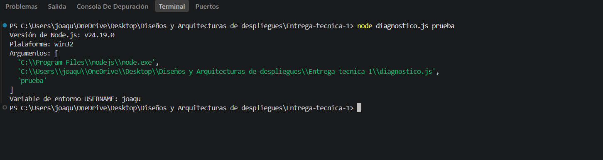
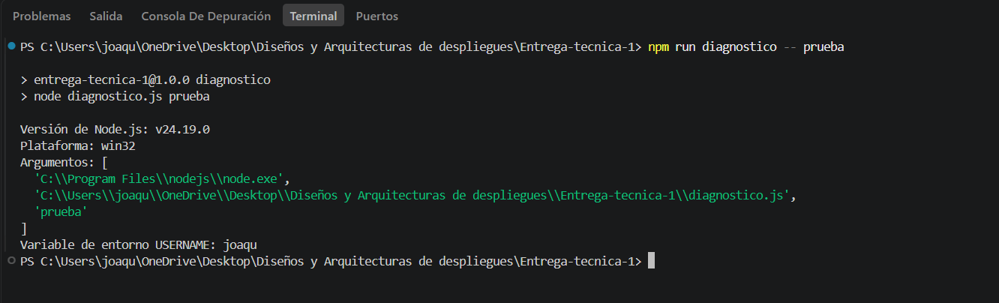

# Entrega Técnica 1 - Diagnóstico del Entorno

## Descripción

Este proyecto corresponde a la Entrega Técnica 1.

El objetivo es realizar un diagnóstico básico del entorno de desarrollo
utilizando Node.js.

## Tecnologías utilizadas

- Node.js
- npm
- Git
- Visual Studio Code

## Archivos

- `diagnostico.js`: programa que muestra información del entorno.
- `package.json`: configuración del proyecto y script de ejecución.
- `README.md`: documentación del proyecto.

## Información mostrada

El programa informa:

- Versión de Node.js.
- Plataforma del sistema operativo.
- Argumentos recibidos mediante `process.argv`.
- Variable de entorno mediante `process.env`.

## Evidencias de ejecución

### 1. Ejecución con Node.js

Se ejecutó el programa utilizando:

node diagnostico.js pruebaco.js prueba

 

### 1. Ejecución mediante npm

Se ejecutó el programa utilizando:

npm run diagnostico -- prueba



---

## Estructura del proyecto
```text
Entrega-tecnica-1/
│
├── evidencias/
│   ├── ejecucion-node.png
│   └──ejecucion-npm.png
│
├── diagnostico.js
├── package.json
└── README.md
```
